# SiriusPro 文档说明

## 开始

### 快速上手

#### 下载SiriusPro框架

```
框架下载	-	https://gitee.com/sichuan-mirror-core-network/SiriusPro/releases/
集成JDK下载	-	https://pan.wer.plus/s/3K5ce
```

解压文件后，你将得到以下目录，如果你下载的是精简版，则没有jdk文件夹，需要手动配置jdk文件，java的版本最低要求为java17

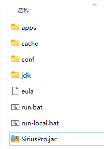

以上目录及文件说明

```
apps			-> java的拓展应用目录，第三方开发者使用java开发的应用请放置到此文件夹
cache			-> 框架的缓存文件夹
conf			-> 框架的配置文件夹，数据库等配置在此文件夹
jdk				-> 集成jdk文件夹
/eula			-> 开源协议同意文件，首次打开请阅读开源协议，同意请修改此文件的false为true
/run.bat		-> 使用此目录集成的jdk运行框架
/run-local.bat	-> 使用本地环境配置的jdk运行框架
/SiriusPro.jar	-> 框架主程序
```

#### 安装及运行

win平台双击run.bat文件可直接运行，也可以通过cmd控制台输入指令运行

```shell
java -jar SiriusPro.jar
```

可通过参数[--server.port]指令绑定框架的后台端口

```shell
java -jar SiriusPro.jar --server.port=8090
```

首次运行会弹出开源协议内容，请将目录下的eula文件中的eula=false修改为eula=true即可同意协议

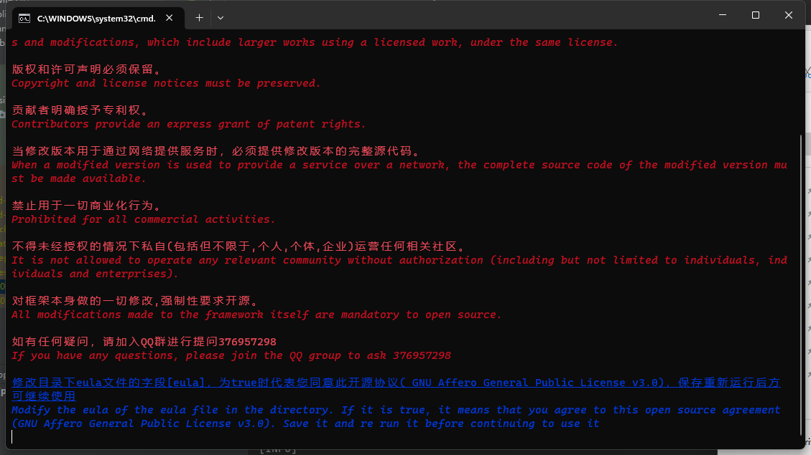

同意开源协议后，重新运行框架，进入数据库配置引导，在此之前请确认系统安装了mysql，如未安装请安装后在继续后续的操作

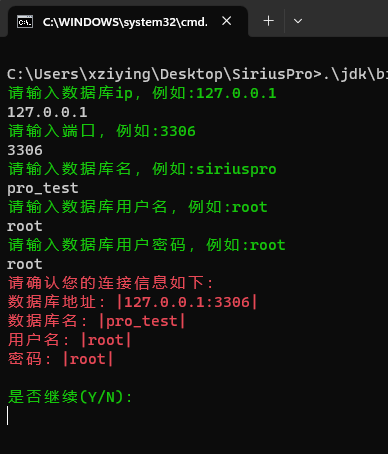

按照提示输入数据库信息后导入数据库表，以及设置后台管理员账号信息

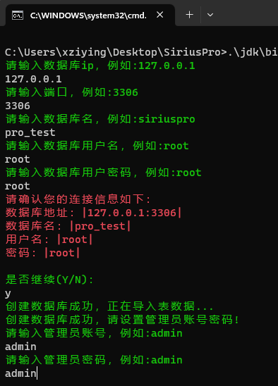

完成引导后框架会自动运行

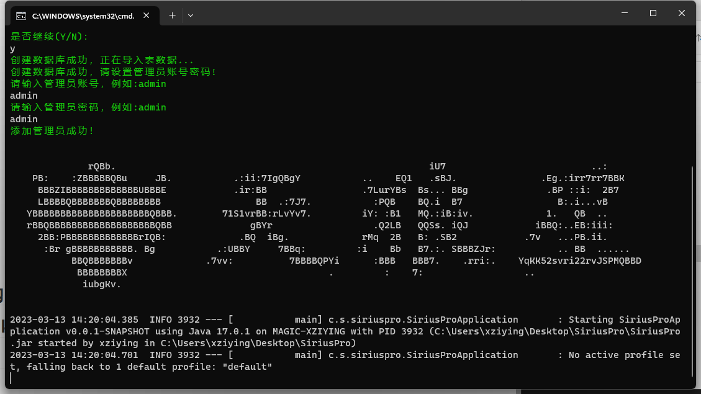

通过浏览器访问http://ip:端口/ 进入后台界面，如果没有自定义配置端口，默认为http://127.0.0.1:8090/，进入界面后界面如下

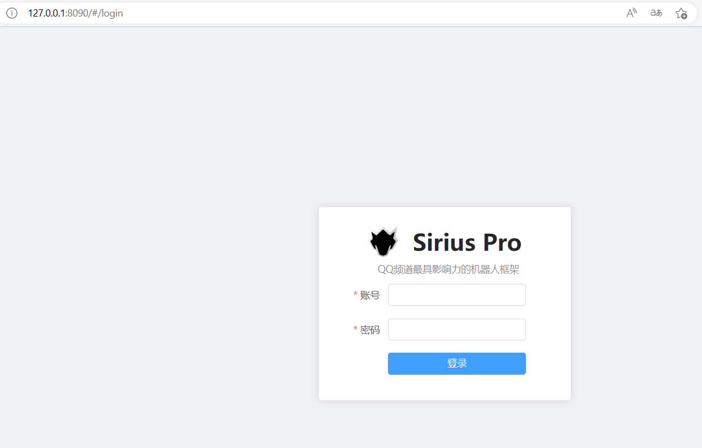

登录后进入后台主界面

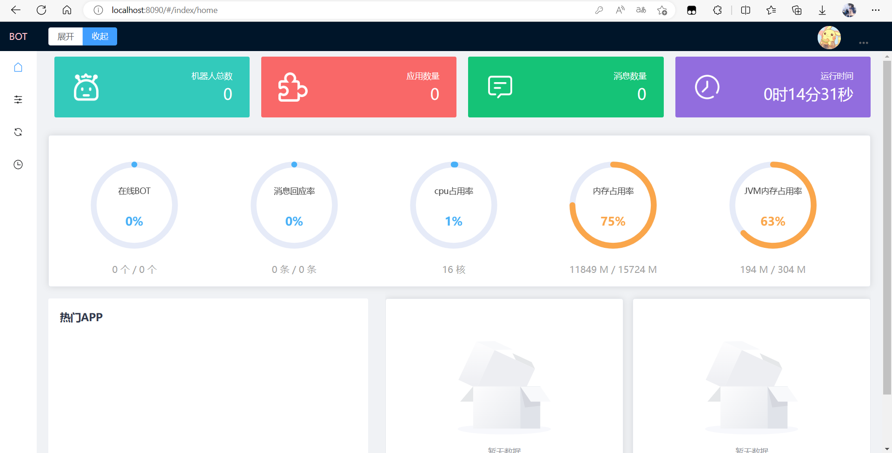

#### linux注册服务

下载linux版本后你将获得一下目录信息

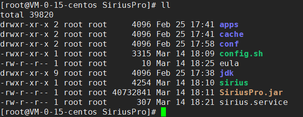

执行config.sh注册sirius和sirius系统服务

```shell
./config.sh
```

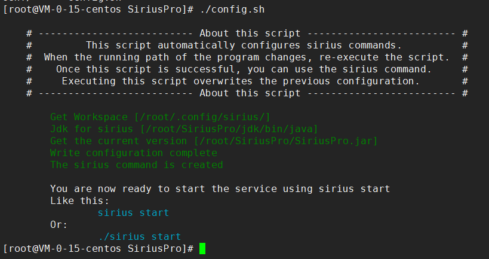

注册指令后，可以通过sirius管理机器人框架

```
sirius start		- 启动框架
sirius start -d		- 静默运行，需要配置框架后才可执行
sirius stop			- 停止框架
sirius restart		- 重启框架
sirius status		- 打印当前状态
sirius enable		- 设置开机启动
sirius disable		- 关闭开机启动
```

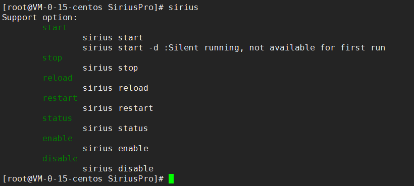

### SDK下载

```
java	-> https://
kotlin	-> https://
QT		-> https://
易语言		->  https://
```

#### Java-SDK 安装

maven构建项目

```xml
<dependency>
  <groupId>cn.siriusbot</groupId>
  <artifactId>siriuspro-sdk</artifactId>
  <version>1.8</version>
</dependency>
```

在引入maven库之前，请先设置maven仓库地址，在项目级pom文件下加入

```xml
<repositories>
    <repository>
        <id>sirius</id>
        <url>https://maven.siriusbot.cn/repository/sirius/</url>
        <releases>
            <enabled>true</enabled>
        </releases>
        <snapshots>
            <enabled>false</enabled>
        </snapshots>
    </repository>
</repositories>
```

## 框架架构

框架源码地址：https://

框架主要分为两个模块，管理后台模块，以及机器人框架模块

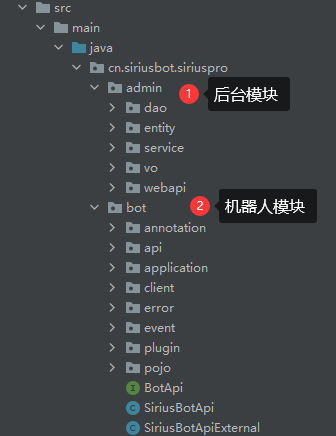

### 机器人框架模块

机器人框架模块基于事件驱动开发，BotClient为单个机器人核心对象接口，其在登录机器人之前，需要配置事件对象，事件对象需要继承BotEvent接口，BotEvent在初始化时将传入BotClient实体对象，供给所有事件使用

```java
/**
 * 机器人客户端
 */
public interface BotClient {

    /**
     * 机器人信息
     */
    BotInfo getInfo();

    /**
     * 机器人会话信息
     */
    BotSession getSession();

    /**
     * 登录机器人
     */
    void start();

    /**
     * 退出机器人
     */
    void close();

    /**
     * 设置配置对象
     *
     * @param config
     * @param <T>
     * @return
     */
    <T extends BotEvent> BotClient setConfig(Class<T> clazz, T config);

    /**
     * 获取配置对象
     *
     * @param clazz
     * @param <T>
     * @return
     */
    <T extends BotEvent> T getBean(Class<T> clazz);

    /**
     * 推送事件信息
     *
     * @param type
     * @param body
     * @param <T>
     */
    <T extends BotEventBody> void pushEvent(BotEventType type, T body);
}
```

```java
public interface BotEvent {
    /**
     * 注入客户端对象，并初始化
     * @param client
     */
    void init(BotClient client);

    /**
     * 机器人登录事件
     */
    void start();
}
```

核心事件列表如下

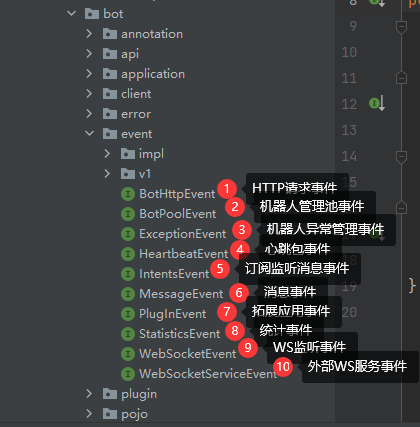

## Websocket接入

开发者可以使用任意语言使用Websocket接入到框架的消息监听系统中

```
ws://ip:port/websocket
默认连接地址为 ws://127.0.0.1:8090/websocket
```

连接后需要发送一段验证JSON包验证信息，具体字段如下，请确保packageName的唯一性

```json
{
    "packageName":"cn.demo",
    "appName":"应用名",
    "appAuthor":"作者",
    "appDesc":"应用说明",
    "appVersion":"V1.0.0",
    "appPath":"应用路径"
}
```

验证通过后框架会返回一段会话id，用于httpapi请求

```json
{
    "code":0,
    "msg":"验证通过",
    "data":"session"
}
```

